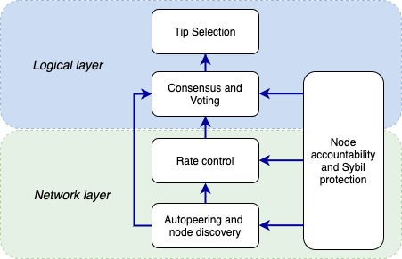
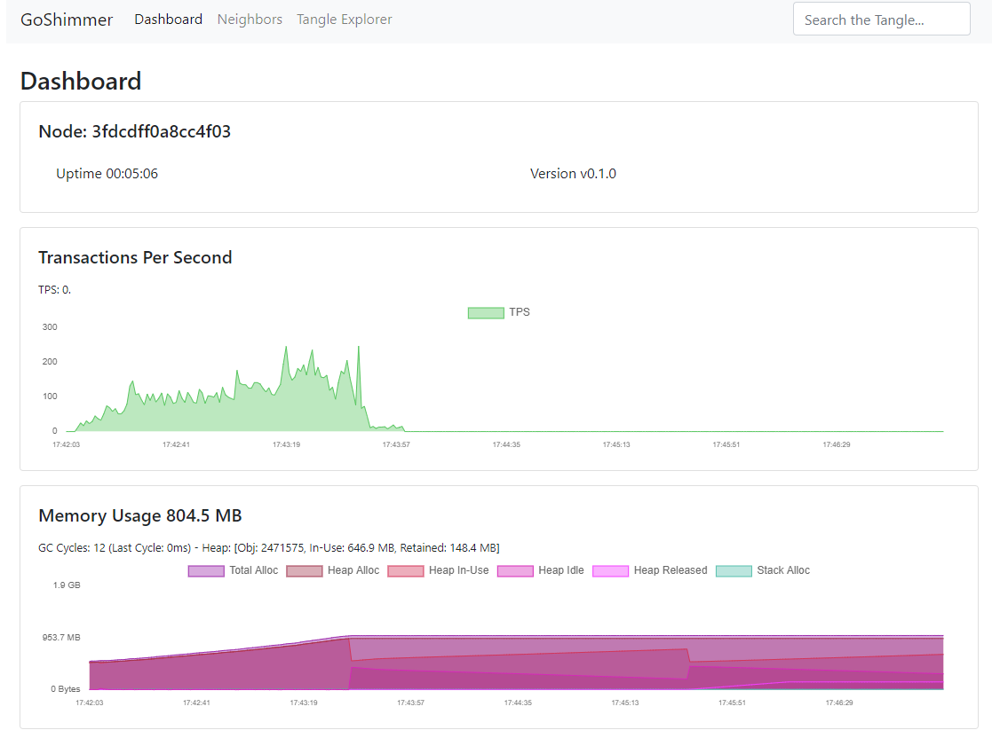

<h1 align="center">
  <br>
  <a href="https://docs.iota.org/docs/node-software/0.1/goshimmer/introduction/overview.md"></a>
</h1>

<h2 align="center">Prototype node software for an IOTA network without the Coordinator</h2>

<p align="center">
    <a href="https://docs.iota.org/docs/node-software/0.1/goshimmer/introduction/overview" style="text-decoration:none;">
    
</p>
<p align="center">
  <a href="https://discord.iota.org/" style="text-decoration:none;"></a>
    <a href="https://iota.stackexchange.com/" style="text-decoration:none;"></a>
    <a href="https://github.com/iotaledger/goshimmer/blob/master/LICENSE" style="text-decoration:none;"></a>
    <a href="https://golang.org/doc/install" style="text-decoration:none;"></a>
    <a href="" style="text-decoration:none;"></a>
    <a href="" style="text-decoration:none;"></a>
</p>
      
<p align="center">
  <a href="#about">About</a> ◈
  <a href="#design">Design</a> ◈
  <a href="#implemented-coordicide-modules">Implemented Coordicide modules</a> ◈
  <a href="#work-in-progress-modules">Work-in-progress modules</a> ◈
  <a href="#installation">Installation</a> ◈
  <a href="#getting-started">Getting started</a> ◈
  <a href="#client-library-and-http-api-reference">Client-Library and HTTP API reference</a> ◈
  <a href="#supporting-the-project">Supporting the project</a> ◈
  <a href="#joining-the-discussion">Joining the discussion</a> 
</p>

---

## About

This repository is where the IOTA Foundation's Research Department runs simulations of the Coordicide modules to study and evaluate their performance.

The aim of this open repository is  to give the community the opportunity to follow developments, take part in testing, and learn  more about [Coordicide](https://coordicide.iota.org/).

**Note:** You can find details about future development plans in our [roadmap](https://roadmap.iota.org).

## Design

The code in GoShimmer is modular, where each module represents either one of the [Coordicide components](https://coordicide.iota.org/) or a basic node function such as the gossip layer, ledger state, and API.  



This approach allows us to develop each module in parallel and to test GoShimmer with one or more different versions.

Each module is defined in the `packages` directory and can be enabled, using the `plugins` directory.

**Note:** See the `main.go` file to see which plugins are currently supported.

## Implemented Coordicide modules

The `master` branch is the stable version of the GoShimmer software, which includes a minimal set of modules to allow you to send and gossip zero-value transactions.

The `master` branch includes the following Coordicide modules: 

- [Node identities](https://coordicide.iota.org/module1)

- [Autopeering](https://coordicide.iota.org/module2)


The autopeering module is divided into two submodules:

- **Peer discovery:** Responsible for operations such as discovering new peers and verifying their online status

- **Neighbor selection:** Responsible for finding and managing neighbors


We also have a standalone autopeering simulator in this [repository](https://github.com/iotaledger/autopeering-sim).

## Work-in-progress modules

Work-in-progress modules are typically kept on a different branch such as `mana`, and are not compatible with the `master` branch. Therefore, nodes that run these branches cannot join the current network because the code either is still too experimental or it includes breaking changes.

The following Coordicide modules are a work in progress: 

- [Mana](https://coordicide.iota.org/module1): The `mana` branch contains a first implementation of the mana module in the `packages` directory.

- [Cellular Consensus](https://coordicide.iota.org/module5.1.1): The `ca` branch contains a first implementation of the Cellular Consensus module in the `packages` directory.

- [Fast Probabilistic Consensus](https://coordicide.iota.org/module5.1.2): The `fpc` branch contains a first implementation of the Fast Probabilistic Consensus  module in the `packages` directory. We also have a standalone FPC simulator in this [repository](https://github.com/iotaledger/fpc-sim).

- [Spam Protection](https://coordicide.iota.org/module3): You can find the initial simulation source code of the rate control in this [repository](https://github.com/andypandypi/IOTARateControl) and the source code of the Adaptive Proof of Work simulator [here](https://github.com/iotaledger/adaptive-pow-sim).

As well as these modules, we are working on the following node functions:

- Ledger State: The `ledger_state` branch implements a version of the [parallel-reality-based ledger state](https://iota.cafe/t/parallel-reality-based-ledger-state-using-utxo/261) (using the UTXO model). 

    

## Client-Library and HTTP API reference

You can use the Go client-library to interact with GoShimmer (located under `github.com/iotaledger/goshimmer/client`).

Alternatively, you can check out the [API docs](https://docs.iota.org/docs/node-software/0.1/goshimmer/references/api-reference) 
to implement your own client or inspect the available HTTP API endpoints.

For code generation, you might want to use the [OAS/Swagger specification file](https://github.com/iotaledger/goshimmer/blob/master/plugins/webapi/api.yaml) directly.

## Installation

You have two options to install and run GoShimmer:

- Use the precompiled executable file
- Compile the code from source

### Execute the precompiled executable file

The [release page](https://github.com/iotaledger/goshimmer/releases) includes downloadable files for Linux, macOS, and Windows.

To run the node, all you need to do is download and execute one of these files, depending on your operating system.

```bash
# Linux and macOS
./goshimmer
# Windows
goshimmer.exe
```

### Compile the code from source

If you want to build your own executable file, you need to follow these steps.

#### Prerequisites

To complete this guide, you need to have at least [version 1.14 of Go installed](https://golang.org/doc/install) on your device.

To check if you have Go installed, run the following command:

```bash
go version
```

If Go is installed, you should see the version that's installed.

---

1. Clone the repository

    ```bash
    git clone https://github.com/iotaledger/goshimmer.git
    ```

2. Change into the `goshimmer` directory

3. Copy and adjust `config.default.json`

    ```bash
    # Linux and macOS
    cp config.default.json config.json
    # Windows
    copy config.default.json config.json
    ```

4. Use one of the following commands to build your executable file, depending on your operating system

    ```bash
    # Linux and macOS
    go build -o goshimmer
    # Windows
    go build -o  goshimmer.exe
    ```

    **Note:** If you're using Windows PowerShell, enclose `goshimmer.exe` in single quotation marks. For example: go build -o 'goshimmer.exe'.

## Getting started

When you first run GoShimmer, the node starts running and tries to connects to neighbors, using the autopeering module.

To run other modules such as the `spammer` or the Glumb visualizer `graph`, you can configure GoShimmer to enable them through plugins.

**Note:** For a list of all the available configuration parameters, you can run the following command:

```bash
# Linux and macOS
./goshimmer -help
# Windows
goshimmer.exe -help
```

You can configure GoShimmer in the following ways:

* Use a configuration file called `config.json`
* Use command-line options

The repository includes a `config.json` file, which the executable file will find and use when you execute it.

To use the command line, execute the file with one of the following commands, depending on your operating system

```bash
# Linux and macOS
./goshimmer --node.enablePlugins "spammer"
# Windows
goshimmer.exe --node.enablePlugins "spammer"
```

Here, we use the command-line flags to enable the spammer plugin. This plugin allows you to send spam transactions to your node.

### Dashboard

GoShimmer provides access to a SPA dashboard showing TPS, memory chart, neighbors and a Tangle explorer.

You can change its configuration (e.g, bind address, port) under the section `dashboard` of the `config.json` file, for example by changing the bind address to `0.0.0.0:8081` to enable the access from remote and/or by enabling the authentication.

To access the dashboard, you can use your browser (the default address is `http://127.0.0.1:8081`).

 

### Installing the Glumb visualizer

The Glumb visualizer allows you to view the transactions in the network, using a web browser.

1. Enable the `graph` plugin either in your `config.json` file or in the command line (`--node.enablePlugins=["graph"]`)

2. If you're running GoShimmer with the precompiled executable file, do the following in the `goshimmer` directory:

    ```bash
    git clone https://github.com/glumb/IOTAtangle.git
    // only this version seems to be stable
    cd IOTAtangle && git reset --hard 07bba77a296a2d06277cdae56aa963abeeb5f66e 
    cd ../
    git clone https://github.com/socketio/socket.io-client.git
    ```

3. If you built the code from source, do the following in the `goshimmer` directory:

    ```bash
    git submodule init
    git submodule update
    ```
    
To open the visualizer, run GoShimmer, and go to `127.0.0.1:8083` in a web browser.

## Supporting the project

If you want to contribute to the code, consider posting a [bug report](https://github.com/iotaledger/goshimmer/issues/new-issue), feature request or a [pull request](https://github.com/iotaledger/goshimmer/pulls/).

When creating a pull request, we recommend that you do the following:

1. Clone the repository
2. Create a new branch for your fix or feature. For example, `git checkout -b fix/my-fix` or ` git checkout -b feat/my-feature`.
3. Run the `go fmt` command to make sure your code is well formatted
4. Document any exported packages
5. Target your pull request to be merged with `dev`

## Joining the discussion

If you want to get involved in the community, need help getting started, have any issues related to the repository or just want to discuss blockchain, distributed ledgers, and IoT with other people, feel free to join our [Discord](https://discord.iota.org/).
